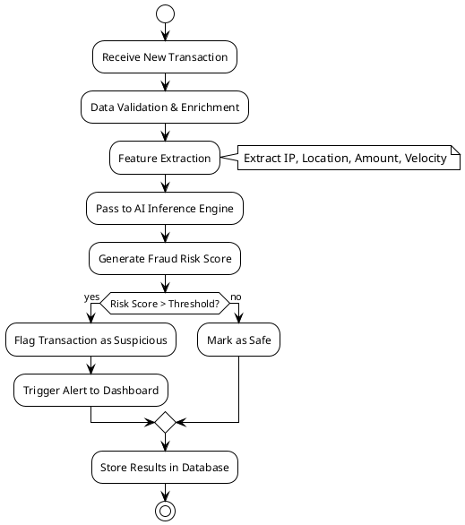
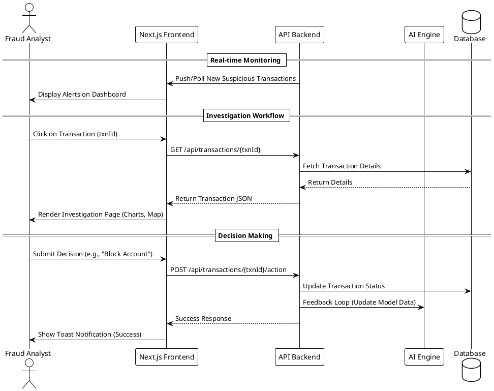

# System Architecture and Pipelines

This document contains the PlantUML diagrams detailing the architecture, data pipeline, and end-to-end flow of the AI Fraud Detection Application.

## 1. System Architecture

```plantuml
@startuml
!theme plain
skinparam componentStyle uml2

package "Frontend (Next.js App Router)" {
  [Dashboard View]
  [Investigation View (/investigation/[txnId])]
  [UI Components (Radix, Tailwind)]
  [Data Visualizations (Recharts, Maps)]
}

package "Backend Services" {
  [API Gateway]
  [Fraud Detection Service]
  [Transaction Service]
  [User Management Service]
}

database "Data Storage" {
  [Transaction Database]
  [AI Model Storage]
}

[Dashboard View] --> [API Gateway] : REST/GraphQL
[Investigation View (/investigation/[txnId])] --> [API Gateway] : REST/GraphQL

[API Gateway] --> [Fraud Detection Service]
[API Gateway] --> [Transaction Service]
[API Gateway] --> [User Management Service]

[Transaction Service] --> [Transaction Database]
[Fraud Detection Service] --> [AI Model Storage]
[Fraud Detection Service] --> [Transaction Database]
@enduml
```

## 2. Data Processing Pipeline



## 3. End-to-End System Architecture Flow


